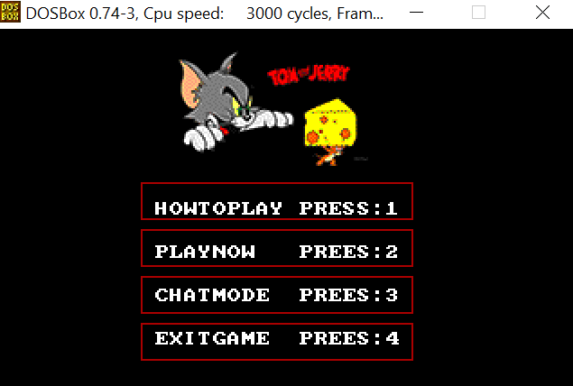
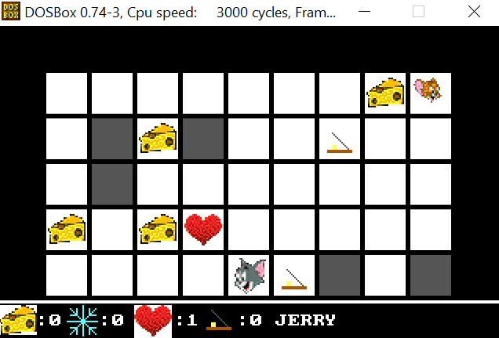
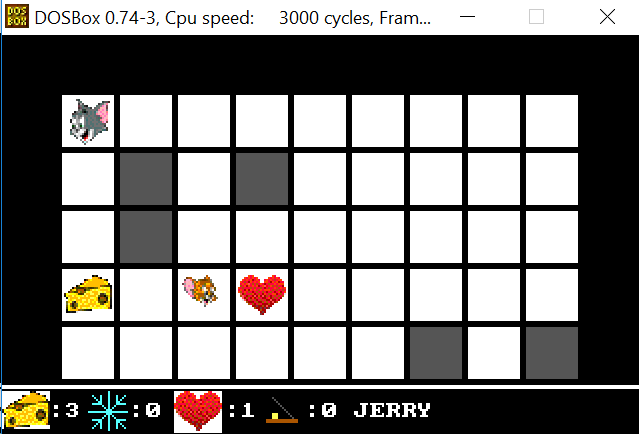
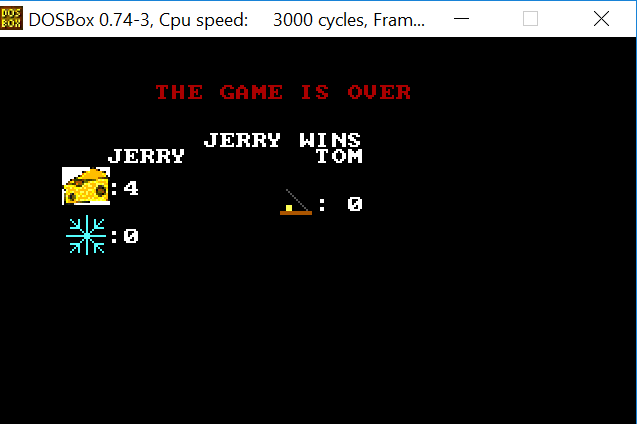

# TOM-JERRY
Assembly 2-player game

Tom:cat: tries to eat jerry:mouse2: as always, but jerry:mouse2: want to escape by winning the game and eat all the cheese:cheese:, they both use weapons:gun: to win.
# Screenshots

# Video
 <video>
  <source src="demo-video.mp4" type="video/mp4">
</video>

# Run:
Open DOSBOX

-mount c c: path of the project's folder

-c:

-micro.exe
